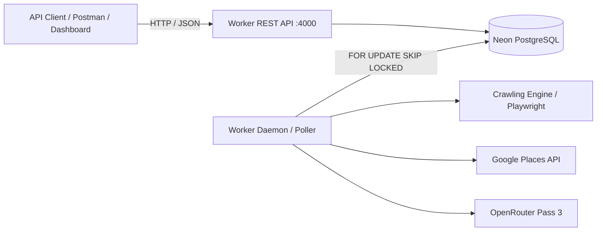

# MonCha Backend API Specification & Reference Documentation

**Project**: MonCha Lead Engine (Phase 1 / Phase 2 Backend)  
**Branch**: `Backend`  
**Base URL**: `http://127.0.0.1:4000` (Worker Test API)  
**Container Health URL**: `http://127.0.0.1:8080` (Worker Daemon Health)  
**Specification Version**: `1.0.0`

---

## 1. Architecture Overview

The MonCha Backend provides REST endpoints for managing automated market discovery, recurrence schedules, company and lead data, and website audit workflows.



---

## 2. Global Request Headers & Authentication

All API routes (`/api/v1/*`) process the following request headers:

| Header | Type | Required | Description | Default / Example |
| :--- | :--- | :---: | :--- | :--- |
| `Content-Type` | `string` | For POST | Must be `application/json` | `application/json` |
| `x-tenant-id` | `string` | Optional | Multi-tenant identifier | `DEFAULT_TENANT_ID` (`tenant_moncha_internal`) |
| `x-api-key` | `string` | Optional | Checked if `WORKER_API_KEY` is configured in `.env` | `""` |

---

## 3. Standard Error Envelope

When an error occurs, the server responds with a standard JSON envelope:

### Validation Error (`400 Bad Request`)
```json
{
  "error": {
    "code": "validation_error",
    "message": "Invalid request",
    "details": {
      "fieldErrors": {
        "time": ["Use 24-hour HH:mm"]
      },
      "formErrors": []
    }
  }
}
```

### Business / HTTP Errors (`400`, `401`, `404`, `409`, `413`)
```json
{
  "error": {
    "code": "not_found",
    "message": "Lead not found"
  }
}
```

Common error codes:
* `validation_error` (400)
* `unauthorized` (401)
* `not_found` (404)
* `method_not_allowed` (405)
* `conflict` (409)
* `payload_too_large` (413)
* `internal_error` (500)

---

## 4. Complete Endpoint Directory

| # | Endpoint URL | HTTP Method | CRUD Type | Summary |
| :-: | :--- | :-: | :-: | :--- |
| **1** | `/health` | `GET` | **READ** | Verifies database ping and lists supported countries |
| **2** | `/api/v1/schedules` | `GET` | **READ** | Lists all daily discovery schedules grouped by country |
| **3** | `/api/v1/schedules` | `POST` | **CREATE** | Registers a new daily crawl schedule for a country |
| **4** | `/api/v1/schedules` | `DELETE` | **DELETE** | Bulk deletes all schedules for a given country |
| **5** | `/api/v1/schedules/:id` | `DELETE` | **DELETE** | Deletes a specific schedule by ID |
| **6** | `/api/v1/schedules/runs` | `GET` | **READ** | Returns past scheduled and manual crawl history |
| **7** | `/api/v1/discovery/country` | `POST` | **CREATE** | Enqueues an immediate country-wide crawl job |
| **8** | `/api/v1/jobs/:id` | `GET` | **READ** | Polls the status and result of a background job |
| **9** | `/api/v1/leads` | `GET` | **READ** | Paginated query of leads with queue, search, and vendor filters |
| **10** | `/api/v1/leads/counts` | `GET` | **READ** | Real-time counts across all 6 queues + open review tasks |
| **11** | `/api/v1/leads` | `POST` | **CREATE / UPDATE** | Manually creates or enriches a lead by domain |
| **12** | `/api/v1/leads/:id` | `GET` | **READ** | Detailed view of a lead, company, website, and audits |
| **13** | `/api/v1/leads/:id/audit` | `POST` | **CREATE** | Triggers or dedupes a fresh 3-pass website audit job |
| **14** | `/health` *(Port 8080)* | `GET` | **READ** | Cloudflare container / worker daemon liveness probe |

---

## 5. Detailed API Endpoint Specifications

---

### 1. System Health Check
Verifies connectivity to Neon PostgreSQL, identifies tenant context, and returns the list of supported country profiles.

* **URL**: `/health`
* **Method**: `GET`
* **CRUD Action**: **READ**
* **Headers**: `x-tenant-id` *(optional)*
* **Query Parameters**: None
* **Request Payload**: None
* **Status Code**: `200 OK`

#### Response Example
```json
{
  "ok": true,
  "db": "up",
  "tenantId": "tenant_moncha_internal",
  "countries": [
    "Singapore (SG)",
    "Malaysia (MY)",
    "Japan (JP)"
  ]
}
```

#### cURL Example
```bash
curl -X GET http://127.0.0.1:4000/health \
  -H "x-tenant-id: tenant_moncha_internal"
```

---

### 2. List Discovery Schedules
Returns all recurring daily discovery schedules under the active tenant, grouped by country.

* **URL**: `/api/v1/schedules`
* **Method**: `GET`
* **CRUD Action**: **READ**
* **Headers**: `x-tenant-id` *(optional)*
* **Query Parameters**: None
* **Request Payload**: None
* **Status Code**: `200 OK`

#### Response Example
```json
{
  "countries": [
    {
      "countryCode": "MY",
      "country": "Malaysia",
      "timesPerDay": 1,
      "schedules": [
        {
          "id": "cm1s9xyz0000abc123def456",
          "countryCode": "MY",
          "country": "Malaysia",
          "time": "10:00",
          "timezone": "Asia/Kuala_Lumpur",
          "nextRunAt": "2026-10-02T02:00:00.000Z",
          "nextRunDay": "today",
          "lastRunAt": "2026-10-01T02:00:00.000Z"
        }
      ]
    },
    {
      "countryCode": "SG",
      "country": "Singapore",
      "timesPerDay": 1,
      "schedules": [
        {
          "id": "cm1s9xyz0001abc123def789",
          "countryCode": "SG",
          "country": "Singapore",
          "time": "09:00",
          "timezone": "Asia/Singapore",
          "nextRunAt": "2026-10-02T01:00:00.000Z",
          "nextRunDay": "tomorrow",
          "lastRunAt": null
        }
      ]
    }
  ]
}
```

#### cURL Example
```bash
curl -X GET http://127.0.0.1:4000/api/v1/schedules \
  -H "x-tenant-id: tenant_moncha_internal"
```

---

### 3. Create Discovery Schedule
Registers a new daily recurring crawl schedule for a given country at a specified wall-clock time and timezone.

* **URL**: `/api/v1/schedules`
* **Method**: `POST`
* **CRUD Action**: **CREATE**
* **Headers**: `Content-Type: application/json`, `x-tenant-id` *(optional)*

#### Request Payload Schema
| Field | Type | Required | Description | Example |
| :--- | :--- | :---: | :--- | :--- |
| `country` | `string` | **Yes** | Country name or ISO alpha-2 code | `"Malaysia"` or `"SG"` |
| `time` | `string` | **Yes** | 24-hour format matching `^([01]\d\|2[0-3]):[0-5]\d$` | `"10:00"` |
| `timezone` | `string` | No | Valid IANA timezone name. Default: `"Asia/Kuala_Lumpur"` | `"Asia/Tokyo"` |

#### Request Payload Example
```json
{
  "country": "Japan",
  "time": "09:30",
  "timezone": "Asia/Tokyo"
}
```

#### Status Codes & Responses
* **`201 Created`**:
```json
{
  "id": "cm1s9xyz0002abc123def012",
  "countryCode": "JP",
  "country": "Japan",
  "time": "09:30",
  "timezone": "Asia/Tokyo",
  "nextRunAt": "2026-10-02T00:30:00.000Z",
  "nextRunDay": "tomorrow",
  "lastRunAt": null
}
```
* **`400 Bad Request`**: Validation error (invalid time format or unrecognized country/timezone).
* **`409 Conflict`**: A schedule already exists for this `[tenantId, countryCode, timeOfDay]`.

#### cURL Example
```bash
curl -X POST http://127.0.0.1:4000/api/v1/schedules \
  -H "Content-Type: application/json" \
  -H "x-tenant-id: tenant_moncha_internal" \
  -d '{"country": "Japan", "time": "09:30", "timezone": "Asia/Tokyo"}'
```

---

### 4. Delete Schedules by Country
Bulk deletes all recurring schedules assigned to a specific country.

* **URL**: `/api/v1/schedules?country={countryName}`
* **Method**: `DELETE`
* **CRUD Action**: **DELETE** (Bulk)
* **Headers**: `x-tenant-id` *(optional)*
* **Query Parameters**:
  * `country` (`string`, **required**): Country name or code (`?country=Malaysia`).
* **Request Payload**: None

#### Status Codes & Responses
* **`200 OK`**:
```json
{
  "deleted": 2
}
```
* **`400 Bad Request`**: Missing `country` query parameter.

#### cURL Example
```bash
curl -X DELETE "http://127.0.0.1:4000/api/v1/schedules?country=Malaysia" \
  -H "x-tenant-id: tenant_moncha_internal"
```

---

### 5. Delete Single Schedule
Deletes an individual schedule row by its unique CUID.

* **URL**: `/api/v1/schedules/:id`
* **Method**: `DELETE`
* **CRUD Action**: **DELETE** (Single Item)
* **Headers**: `x-tenant-id` *(optional)*
* **Path Parameters**:
  * `id` (`string`, **required**): Unique identifier of the schedule.
* **Request Payload**: None

#### Status Codes & Responses
* **`200 OK`**:
```json
{
  "deleted": true
}
```
* **`404 Not Found`**:
```json
{
  "error": {
    "code": "not_found",
    "message": "Schedule not found"
  }
}
```

#### cURL Example
```bash
curl -X DELETE http://127.0.0.1:4000/api/v1/schedules/cm1s9xyz0002abc123def012 \
  -H "x-tenant-id: tenant_moncha_internal"
```

---

### 6. List Schedule Run History
Retrieves past execution logs of automated daily crawls and manual discovery runs.

* **URL**: `/api/v1/schedules/runs`
* **Method**: `GET`
* **CRUD Action**: **READ**
* **Headers**: `x-tenant-id` *(optional)*
* **Query Parameters**:
  * `limit` (`number`, *optional*, default: `50`, min: `1`, max: `200`): Maximum entries to return.
* **Request Payload**: None
* **Status Code**: `200 OK`

#### Response Example
```json
{
  "runs": [
    {
      "id": "cm1s9run0000xyz123def456",
      "day": "2026-10-01",
      "countryCode": "SG",
      "country": "Singapore",
      "time": "10:00",
      "timezone": "Asia/Singapore",
      "trigger": "schedule",
      "status": "done",
      "found": 60,
      "saved": 42,
      "skipped": 18,
      "stoppedReason": "completed",
      "error": null,
      "startedAt": "2026-10-01T02:00:00.120Z",
      "finishedAt": "2026-10-01T02:02:15.890Z"
    }
  ]
}
```

#### cURL Example
```bash
curl -X GET "http://127.0.0.1:4000/api/v1/schedules/runs?limit=20" \
  -H "x-tenant-id: tenant_moncha_internal"
```

---

### 7. Trigger Country-Wide Discovery Crawl
Queues a `country_discovery` job. The worker poller will claim the job and execute Google Places text searches across the country's planning areas / cities and target industries.

* **URL**: `/api/v1/discovery/country`
* **Method**: `POST`
* **CRUD Action**: **CREATE** (Enqueues Job)
* **Headers**: `Content-Type: application/json`, `x-tenant-id` *(optional)*

#### Request Payload Schema
| Field | Type | Required | Description | Default |
| :--- | :--- | :---: | :--- | :--- |
| `country` | `string` | **Yes** | `"Singapore"`, `"Malaysia"`, or `"Japan"` | N/A |
| `source` | `string` | No | Discovery engine provider | `"google_places"` |
| `cities` | `string[]` | No | Restrict crawl to these search areas/cities | All country cities |
| `industries` | `string[]` | No | Restrict crawl to these keywords/sectors | 32 default industries |
| `maxPages` | `number` | No | Google Places pages per search (20 results/page, 1-3) | `3` |
| `maxSearches` | `number` | No | Cap the number of searches in this execution | Unlimited |
| `maxCallsPerDay` | `number` | No | Override daily Google Places request limit | Environment default (500) |
| `reset` | `boolean` | No | If `true`, resets existing search targets back to `pending` | `false` |

#### Request Payload Example
```json
{
  "country": "Singapore",
  "source": "google_places",
  "cities": ["Bedok", "Tampines"],
  "industries": ["dentist", "medical clinic"],
  "maxPages": 3,
  "maxSearches": 10,
  "maxCallsPerDay": 500,
  "reset": false
}
```

#### Status Codes & Responses
* **`202 Accepted`**:
```json
{
  "id": "cm1s9job0000xyz123def456",
  "status": "pending",
  "type": "country_discovery"
}
```
* **`400 Bad Request`**: Validation failure or unsupported country name.

#### cURL Example
```bash
curl -X POST http://127.0.0.1:4000/api/v1/discovery/country \
  -H "Content-Type: application/json" \
  -H "x-tenant-id: tenant_moncha_internal" \
  -d '{"country": "Singapore", "maxSearches": 2}'
```

---

### 8. Get Job Status
Polls the execution state, attempt counter, error messages, and result payload of an asynchronous background job.

* **URL**: `/api/v1/jobs/:id`
* **Method**: `GET`
* **CRUD Action**: **READ**
* **Headers**: `x-tenant-id` *(optional)*
* **Path Parameters**:
  * `id` (`string`, **required**): Job ID returned when enqueued.
* **Request Payload**: None

#### Status Codes & Responses
* **`200 OK`**:
```json
{
  "id": "cm1s9job0000xyz123def456",
  "tenantId": "tenant_moncha_internal",
  "type": "country_discovery",
  "status": "done",
  "payload": {
    "mode": "country",
    "origin": "manual",
    "country": "Singapore",
    "countryCode": "SG",
    "maxPages": 3
  },
  "result": {
    "country": "Singapore",
    "countryCode": "SG",
    "plannedTargets": 1472,
    "newTargets": 0,
    "searches": 2,
    "failedSearches": 0,
    "calls": 2,
    "callsToday": 4,
    "found": 40,
    "created": 28,
    "duplicates": 12,
    "auditsEnqueued": 28,
    "noWebsite": 0,
    "stoppedReason": "max_searches_reached"
  },
  "attempts": 1,
  "maxAttempts": 1,
  "runAfter": "2026-10-01T04:00:00.000Z",
  "lockedAt": null,
  "lockedBy": null,
  "lastError": null,
  "dedupeKey": null,
  "startedAt": "2026-10-01T04:00:01.000Z",
  "finishedAt": "2026-10-01T04:00:45.000Z",
  "createdAt": "2026-10-01T03:59:58.000Z"
}
```
* **`404 Not Found`**: Job does not exist for this tenant.

#### cURL Example
```bash
curl -X GET http://127.0.0.1:4000/api/v1/jobs/cm1s9job0000xyz123def456 \
  -H "x-tenant-id: tenant_moncha_internal"
```

---

### 9. List Leads
Fetches paginated leads with full company details, website state, and source provenance.

* **URL**: `/api/v1/leads`
* **Method**: `GET`
* **CRUD Action**: **READ**
* **Headers**: `x-tenant-id` *(optional)*

#### Query Parameters
| Parameter | Type | Required | Description | Default |
| :--- | :--- | :---: | :--- | :--- |
| `queue` | `string` | No | Target queue: `PENDING_AUDIT`, `QUALIFIED`, `HAS_ASSISTANT`, `NO_WEBSITE`, `NEEDS_REVIEW`, `INACTIVE` | `"QUALIFIED"` |
| `page` | `number` | No | Page number (1-indexed) | `1` |
| `pageSize` | `number` | No | Number of records per page (1 to 100) | `25` |
| `search` | `string` | No | Substring match against company name or website domain | None |
| `country` | `string` | No | Filter by company country | None |
| `assistantVerdict` | `string` | No | Filter by `NO_ASSISTANT`, `HAS_ASSISTANT`, `UNCERTAIN`, `NOT_APPLICABLE` | None |
| `vendor` | `string` | No | Filter by detected vendor (e.g. `Intercom`, `Zendesk`) | None |
| `method` | `string` | No | Filter by audit method pass (`html`, `render`, `llm`) | None |

#### Status Code: `200 OK`
```json
{
  "items": [
    {
      "id": "cm1s9lead0000xyz123def456",
      "tenantId": "tenant_moncha_internal",
      "companyId": "cm1s9comp0000xyz123def456",
      "queue": "QUALIFIED",
      "assistantVerdict": "NO_ASSISTANT",
      "assistantVendor": null,
      "qualificationReason": "no_assistant_high_confidence",
      "latestAuditId": "cm1s9audit0000xyz123def456",
      "version": 2,
      "createdAt": "2026-10-01T04:00:00.000Z",
      "updatedAt": "2026-10-01T04:01:25.000Z",
      "company": {
        "id": "cm1s9comp0000xyz123def456",
        "tenantId": "tenant_moncha_internal",
        "name": "Bedok Family Clinic",
        "domain": "bedokfamilyclinic.com.sg",
        "country": "Singapore",
        "city": "Bedok",
        "phone": "+65 6789 1234",
        "address": "Blk 214 Bedok North Street 1",
        "website": {
          "id": "cm1s9web0000xyz123def456",
          "tenantId": "tenant_moncha_internal",
          "companyId": "cm1s9comp0000xyz123def456",
          "url": "https://bedokfamilyclinic.com.sg",
          "canonicalUrl": "https://www.bedokfamilyclinic.com.sg/",
          "status": "ACTIVE",
          "language": "en",
          "finalUrl": "https://www.bedokfamilyclinic.com.sg/",
          "httpStatus": 200,
          "title": "Bedok Family Clinic - Healthcare Services",
          "latestAuditId": "cm1s9audit0000xyz123def456",
          "lastCheckedAt": "2026-10-01T04:01:20.000Z"
        },
        "sourceRecords": [
          {
            "id": "cm1s9src0000xyz123def456",
            "tenantId": "tenant_moncha_internal",
            "companyId": "cm1s9comp0000xyz123def456",
            "source": "google_places",
            "externalId": "ChIJxyz12345678",
            "rawJson": {
              "place_id": "ChIJxyz12345678"
            }
          }
        ]
      }
    }
  ],
  "total": 45,
  "page": 1,
  "pageSize": 25,
  "totalPages": 2
}
```

#### cURL Example
```bash
curl -X GET "http://127.0.0.1:4000/api/v1/leads?queue=QUALIFIED&page=1&pageSize=25" \
  -H "x-tenant-id: tenant_moncha_internal"
```

---

### 10. Get Lead Queue Counts
Returns real-time aggregate statistics for all lead queues, along with open human review tasks.

* **URL**: `/api/v1/leads/counts`
* **Method**: `GET`
* **CRUD Action**: **READ** (Aggregation)
* **Headers**: `x-tenant-id` *(optional)*
* **Query Parameters**: None
* **Request Payload**: None
* **Status Code**: `200 OK`

#### Response Example
```json
{
  "PENDING_AUDIT": 14,
  "QUALIFIED": 92,
  "HAS_ASSISTANT": 35,
  "NO_WEBSITE": 8,
  "NEEDS_REVIEW": 4,
  "INACTIVE": 2,
  "openReviewTasks": 4
}
```

#### cURL Example
```bash
curl -X GET http://127.0.0.1:4000/api/v1/leads/counts \
  -H "x-tenant-id: tenant_moncha_internal"
```

---

### 11. Create / Enrich Lead Manually
Creates a new lead manually. If a company with the same domain already exists under the tenant, it enriches any blank fields and re-uses the existing company and lead. If a domain or website URL is present, an audit is queued automatically.

* **URL**: `/api/v1/leads`
* **Method**: `POST`
* **CRUD Action**: **CREATE / UPDATE** (Upsert & Enrich)
* **Headers**: `Content-Type: application/json`, `x-tenant-id` *(optional)*

#### Request Payload Schema
| Field | Type | Required | Description | Example |
| :--- | :--- | :---: | :--- | :--- |
| `name` | `string` | **Yes** | Business / company name | `"Orchard Dental Surgery"` |
| `domain` | `string` | No | Naked domain or website URL | `"orcharddental.com.sg"` |
| `country` | `string` | No | Country name | `"Singapore"` |
| `city` | `string` | No | City or planning area | `"Orchard"` |
| `phone` | `string` | No | Contact telephone | `"+65 6235 9999"` |
| `address` | `string` | No | Physical street address | `"304 Orchard Road #05-01"` |

#### Request Payload Example
```json
{
  "name": "Orchard Dental Surgery",
  "domain": "orcharddental.com.sg",
  "country": "Singapore",
  "city": "Orchard",
  "phone": "+65 6235 9999",
  "address": "304 Orchard Road #05-01 Lucky Plaza"
}
```

#### Status Codes & Responses
* **`201 Created`** *(New record)* or **`200 OK`** *(Existing record enriched)*:
```json
{
  "skipped": false,
  "created": true,
  "duplicate": false,
  "auditEnqueued": true,
  "company": {
    "id": "cm1s9comp0002xyz123def456",
    "tenantId": "tenant_moncha_internal",
    "name": "Orchard Dental Surgery",
    "domain": "orcharddental.com.sg",
    "country": "Singapore",
    "city": "Orchard",
    "phone": "+65 6235 9999",
    "address": "304 Orchard Road #05-01 Lucky Plaza"
  },
  "lead": {
    "id": "cm1s9lead0002xyz123def456",
    "tenantId": "tenant_moncha_internal",
    "companyId": "cm1s9comp0002xyz123def456",
    "queue": "PENDING_AUDIT",
    "assistantVerdict": null,
    "qualificationReason": "pending_audit",
    "version": 1
  }
}
```
* **`400 Bad Request`**: Validation error (missing required business name).

#### cURL Example
```bash
curl -X POST http://127.0.0.1:4000/api/v1/leads \
  -H "Content-Type: application/json" \
  -H "x-tenant-id: tenant_moncha_internal" \
  -d '{"name": "Orchard Dental Surgery", "domain": "orcharddental.com.sg", "country": "Singapore"}'
```

---

### 12. Get Single Lead Details
Returns the full record for a specific lead, including associated company metadata, website state, and discovery sources.

* **URL**: `/api/v1/leads/:id`
* **Method**: `GET`
* **CRUD Action**: **READ**
* **Headers**: `x-tenant-id` *(optional)*
* **Path Parameters**:
  * `id` (`string`, **required**): Lead ID (CUID).
* **Request Payload**: None

#### Status Codes & Responses
* **`200 OK`**:
```json
{
  "id": "cm1s9lead0000xyz123def456",
  "tenantId": "tenant_moncha_internal",
  "companyId": "cm1s9comp0000xyz123def456",
  "queue": "QUALIFIED",
  "assistantVerdict": "NO_ASSISTANT",
  "assistantVendor": null,
  "qualificationReason": "no_assistant_high_confidence",
  "latestAuditId": "cm1s9audit0000xyz123def456",
  "version": 2,
  "createdAt": "2026-10-01T04:00:00.000Z",
  "updatedAt": "2026-10-01T04:01:25.000Z",
  "company": {
    "id": "cm1s9comp0000xyz123def456",
    "tenantId": "tenant_moncha_internal",
    "name": "Bedok Family Clinic",
    "domain": "bedokfamilyclinic.com.sg",
    "country": "Singapore",
    "city": "Bedok",
    "phone": "+65 6789 1234",
    "address": "Blk 214 Bedok North Street 1",
    "website": {
      "id": "cm1s9web0000xyz123def456",
      "tenantId": "tenant_moncha_internal",
      "companyId": "cm1s9comp0000xyz123def456",
      "url": "https://bedokfamilyclinic.com.sg",
      "canonicalUrl": "https://www.bedokfamilyclinic.com.sg/",
      "status": "ACTIVE",
      "language": "en",
      "finalUrl": "https://www.bedokfamilyclinic.com.sg/",
      "httpStatus": 200,
      "title": "Bedok Family Clinic",
      "latestAuditId": "cm1s9audit0000xyz123def456",
      "lastCheckedAt": "2026-10-01T04:01:20.000Z"
    },
    "sourceRecords": [
      {
        "id": "cm1s9src0000xyz123def456",
        "source": "google_places",
        "externalId": "ChIJxyz12345678"
      }
    ]
  }
}
```
* **`404 Not Found`**:
```json
{
  "error": {
    "code": "not_found",
    "message": "Lead not found"
  }
}
```

#### cURL Example
```bash
curl -X GET http://127.0.0.1:4000/api/v1/leads/cm1s9lead0000xyz123def456 \
  -H "x-tenant-id: tenant_moncha_internal"
```

---

### 13. Trigger Lead Website Re-Audit
Forces a new 3-pass website audit job for a specific lead. If a job is already queued (`pending` or `running`) for this lead, it returns the existing job without creating a redundant task.

* **URL**: `/api/v1/leads/:id/audit`
* **Method**: `POST`
* **CRUD Action**: **CREATE** (Enqueues Job)
* **Headers**: `x-tenant-id` *(optional)*
* **Path Parameters**:
  * `id` (`string`, **required**): Lead ID (CUID).
* **Request Payload**: None

#### Status Codes & Responses
* **`202 Accepted`** *(Newly enqueued)*:
```json
{
  "id": "cm1s9auditjob0001xyz123",
  "status": "pending"
}
```
* **`202 Accepted`** *(Already running or pending)*:
```json
{
  "id": "cm1s9auditjob0000xyz987",
  "status": "running",
  "deduped": true
}
```
* **`404 Not Found`**: Lead does not exist or has no company website domain.

#### cURL Example
```bash
curl -X POST http://127.0.0.1:4000/api/v1/leads/cm1s9lead0000xyz123def456/audit \
  -H "x-tenant-id: tenant_moncha_internal"
```

---

### 14. Worker Container Liveness Check
Exposed by the long-running worker poller process (`apps/worker/src/poller.ts`) on port `8080` (configured via `HEALTH_PORT=8080` in Cloudflare container deployment).

* **URL**: `http://127.0.0.1:8080/health`
* **Method**: `GET`
* **CRUD Action**: **READ**
* **Headers**: None
* **Query Parameters**: None
* **Request Payload**: None
* **Status Code**: `200 OK`

#### Response Example
```json
{
  "ok": true,
  "workerId": "worker-local-9a8b7c6d",
  "startedAt": "2026-10-01T04:30:00.000Z",
  "crawlRunning": false
}
```

#### cURL Example
```bash
curl -X GET http://127.0.0.1:8080/health
```

---

## 6. Testing with Postman

A preconfigured Postman collection is available at:  
[`apps/worker/postman/moncha-worker-api.postman_collection.json`](apps/worker/postman/moncha-worker-api.postman_collection.json)

### Collection Variables
* `baseUrl`: `http://127.0.0.1:4000`
* `tenantId`: `tenant_moncha_internal`
* `apiKey`: Optional test API key
* Automatic test assertions capture generated `scheduleId`, `jobId`, and `leadId` values for seamless end-to-end testing.
