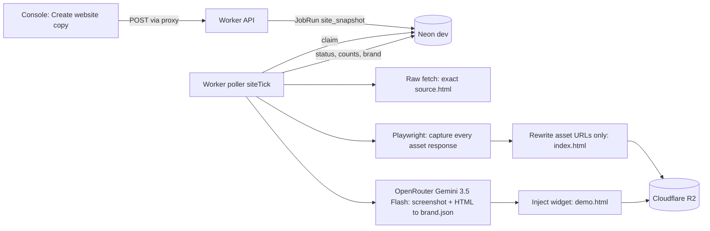

# Website Copy Agent Plan (Phase 3: manual first, automation later)

Add a "website copy" agent that you start by hand for one lead. It:

- saves the site's exact view-source HTML,
- copies every asset (logo, images, CSS, JS, fonts) into Cloudflare R2,
- uses Gemini 3.5 Flash through OpenRouter to pull out brand details,
- builds a MonCha chatbot demo page on top of the unchanged copy.

The console gets a review screen linked from the existing lead detail page. Automation comes after the manual flow works.

---

## Task checklist

- [ ] **Database**: add the `SiteSnapshot` model and the `site_snapshot` JobType, write the migration on the Neon dev branch, add the repository, and extend `claimJobs` / `recoverStuck`.
- [ ] **R2**: add `R2SiteStore` (S3 client) in integrations, the `SiteStore` port in domain, and the env keys in `.env.example` and `railway.ts`.
- [ ] **Capture**: build `site-capture.ts`. It saves the exact raw source, captures assets with Playwright (desktop and mobile), parses CSS `url()` references, rewrites only asset URLs for `index.html`, and enforces size limits.
- [ ] **Gemini**: add a multimodal `completeJsonWithImages` call to the OpenRouter client, the `brand.json` zod schema and prompt, and the `LlmUsage` budget check.
- [ ] **Job**: add the `runSiteSnapshotJob` use case (capture, copy assets, Gemini, inject the widget into `demo.html`, upload to R2) and a `siteTick` loop in `poller.ts`.
- [ ] **API**: add the site-snapshot endpoints, the signed `site-files` byte stream, and the contracts schemas. Update the API docs and the Postman collection.
- [ ] **Console**: add the "Website copy" card on lead detail, the snapshot page (Preview, View source, Brand, Assets and Details tabs), the `/sites` list page with a nav item, the binary proxy route, and the query hooks.
- [ ] **Verify**: write tests for the URL rewriter and parser, then check by hand on 3 or 4 real leads: the source SHA-256 matches, the offline copy matches the live site, the brand details are right, and the demo widget appears.

---

## What the agent produces for one lead

Each run creates one **snapshot** in R2 under `sites/{tenantId}/{snapshotId}/`:

- `source.html`: the exact bytes the server returned for the homepage. This is what Ctrl+U "View page source" shows. It is never modified.
- `rendered.html`: the page HTML after JavaScript runs. Useful for sites built with JavaScript. Kept for reference only.
- `assets/...`: every file the page loaded (logo, favicon, images, CSS, JS, fonts, SVG, background images found in CSS), stored by original host and path.
- `index.html`: an offline copy. It is `source.html` with **only the asset URLs rewritten** to point at the stored copies, so the page looks the same without loading anything from the live site. Nothing else changes.
- `demo.html`: `index.html` plus one injected `<script>` that adds a MonCha chatbot widget in the brand colors. This is the page you use for outreach.
- `brand.json`: what Gemini extracted: logo URL, colors, fonts, business name, phone, email, address, services, opening hours, social links, language, tone, a suggested chatbot greeting, and starter FAQs.
- `manifest.json`: the asset list (original URL, stored path, content type, size, hash).
- `screenshot-desktop.png` and `screenshot-mobile.png`.

---

## Backend

### 1. Database

Files: [packages/db/prisma/schema.prisma](packages/db/prisma/schema.prisma) plus a new migration (Neon dev branch only).

- Add `site_snapshot` to the `JobType` enum.
- New `SiteSnapshot` model with these fields: `id, tenantId, leadId, jobId, status (pending|running|done|failed), sourceUrl, finalUrl, httpStatus, storagePrefix, sourceHash, sourceBytes, assetCount, totalBytes, brand Json?, llmModel, llmPromptTokens, llmCompletionTokens, failureReason, createdAt, finishedAt`.
  - Indexes on `[tenantId, leadId, createdAt]` and `[tenantId, createdAt]`.
- New `PrismaSiteSnapshotRepository` in [packages/db/src/repositories/](packages/db/src/repositories/).
- In [packages/db/src/repositories/job-run.ts](packages/db/src/repositories/job-run.ts), let `claimJobs` and `recoverStuck` handle `site_snapshot`.

### 2. R2 storage

Location: [packages/integrations](packages/integrations).

- Add `@aws-sdk/client-s3`.
- New `r2.ts` with `R2SiteStore` (`put`, `get` as a stream, `list`), using the S3 endpoint `https://{R2_ACCOUNT_ID}.r2.cloudflarestorage.com`.
- Add a `SiteStore` port in [packages/domain/src/ports/index.ts](packages/domain/src/ports/index.ts) so tests can use local disk instead.
- New env keys in [apps/worker/.env.example](apps/worker/.env.example) and [.railway/railway.ts](.railway/railway.ts):
  - `R2_ACCOUNT_ID`
  - `R2_ACCESS_KEY_ID`
  - `R2_SECRET_ACCESS_KEY`
  - `R2_BUCKET`
  - `SITE_AGENT_MODEL=google/gemini-3.5-flash`
  - `SITE_AGENT_TIMEOUT_MS=90000`
  - `SITE_PREVIEW_SECRET`

### 3. Capture

New file: `packages/crawling/src/site-capture.ts`. It reuses the Playwright browser, `assertSafeUrl`, the robots check and the host rate limiter from [render-pass.ts](packages/crawling/src/render-pass.ts).

- Fetch the final homepage URL directly, without a browser. Save the original bytes and charset as `source.html`.
- Open the page in Playwright at desktop (1440px) and mobile (390px) widths.
  - Use `page.on('response')` to save the body of every asset the page loads.
  - Scroll the page so lazy-loaded images load.
  - Take the screenshots, and save `page.content()` as `rendered.html`.
- Find asset URLs in `source.html` and in the downloaded CSS: `src`, `srcset`, `href` (stylesheets, icons, preloads), URLs inside inline `style` attributes, and CSS `url()` / `@import`. Download anything the browser missed.
- Rewriter: in `index.html` and the CSS files, replace only those URL strings with `assets/{host}/{path}`. It works on the raw text, so formatting, comments and attribute order stay byte-identical everywhere else.
- Limits:
  - 400 assets per snapshot
  - 10 MB per file
  - 80 MB per snapshot
  - skip tracking and analytics hosts
  - block private IP addresses

### 4. Gemini brand extraction

File: [packages/integrations/src/openrouter.ts](packages/integrations/src/openrouter.ts).

- Add `completeJsonWithImages`, which sends images using OpenRouter's multimodal `image_url` message parts. It has its own model and timeout settings. Pass 3 keeps using `completeJson` unchanged.
- What Gemini receives: the desktop screenshot, the page's visible text (trimmed), the `<head>` meta tags, and candidate logo URLs from the manifest.
- What it returns: `brand.json`, validated with zod. Gemini never edits the HTML.
- Each call counts against the existing `LlmUsage` daily budget.
- Before the first run, check the exact model name on OpenRouter. It is set through `SITE_AGENT_MODEL`, so it can change without a code edit.

### 5. Use case and job

New file: `packages/domain/src/use-cases/runSiteSnapshotJob.ts`.

- Steps, in order:
  1. Capture the page.
  2. Save the asset copies and build `index.html`.
  3. Ask Gemini for `brand.json`.
  4. Build `demo.html` by injecting `<script src="moncha-widget.js" data-config=...>` before `</body>`.
  5. Upload everything to R2.
  6. Update `SiteSnapshot` and `JobRun`.
- If any step fails, the snapshot is marked `failed` with a reason. Files already uploaded are kept.
- In [apps/worker/src/poller.ts](apps/worker/src/poller.ts), add a `siteTick` loop that claims one `site_snapshot` job at a time, the same way `countryTick` works.

### 6. API

Routes go in [apps/worker/src/api.ts](apps/worker/src/api.ts) and schemas in [packages/contracts/src/index.ts](packages/contracts/src/index.ts). Contract changes are additive only.

| Method | Path | Purpose |
| :-- | :-- | :-- |
| POST | `/api/v1/leads/:id/site-snapshots` | Queue a snapshot; returns 202 `{ jobId, snapshotId }` |
| GET | `/api/v1/leads/:id/site-snapshots` | Snapshot history for one lead |
| GET | `/api/v1/site-snapshots?page&pageSize&status&search` | All snapshots |
| GET | `/api/v1/site-snapshots/:id` | Detail, brand, manifest summary, signed `previewBase` |
| GET | `/api/v1/site-snapshots/:id/source` | `{ source, charset, bytes, sha256 }` as JSON |
| GET | `/api/v1/site-files/:token/*path` | Streams file bytes from R2 |

Notes on these routes:

- **POST site-snapshots**: if a job is already pending or running for the lead, the endpoint returns that job instead of creating a new one.
- **`/source`**: returns JSON, so it works through the console's existing JSON proxy.
- **`site-files`**: sends the correct content type for each file. The token is an HMAC of `snapshotId` plus an expiry time, so the sandboxed preview iframe can load files without cookies. This route needs a send function for raw bytes, alongside the existing JSON one.

Update [API_DOCUMENTATION.md](API_DOCUMENTATION.md) and the Postman collection.

---

## Console

The new screens use the existing app shell and UI kit.

### Lead detail page

File: [lead-detail-view.tsx](<apps/console/app/(app)/leads/[id]/lead-detail-view.tsx>).

Add a "Website copy" card showing:

- the latest snapshot status and a screenshot thumbnail,
- a "Create website copy" button (editors only), with progress tracking like the existing `AuditTracker`,
- an "Open" button.

### Snapshot page

Route: `apps/console/app/(app)/leads/[id]/site/[snapshotId]/`.

The header shows the company name, status badge, source URL, created time and Gemini token usage. Tabs:

- **Preview**: switch between the original copy and the MonCha demo, at desktop, tablet or mobile width. The page loads in an `<iframe sandbox="allow-scripts">`. Without same-origin access, the copied site's scripts cannot read console cookies.
- **View source**: the exact `source.html` in a read-only viewer with line numbers, a wrap toggle, copy and download buttons, and the byte size plus SHA-256 so you can confirm it matches the original.
- **Brand**: logo, color swatches with hex values, fonts, contact details, services, opening hours, social links, the suggested greeting and FAQs.
- **Assets**: a grid and a table you can filter by type (image, CSS, JS, font), with size, original URL and a download link.
- **Details**: job timeline, failures and skipped assets.

### Other console changes

- **New nav item**: "Website copies" (`/sites`) in [app-shell.tsx](apps/console/components/app/app-shell.tsx), under the leads group. It opens a paginated table of snapshots with status, lead and created time.
- **Binary proxy**: new `apps/console/app/api/site-files/[...path]/route.ts`, which streams the backend `site-files` bytes. It is needed because the existing [proxy route](apps/console/app/api/proxy/[...path]/route.ts) returns JSON only. The browser still never calls the backend directly.
- **Hooks and types**: `useSiteSnapshots`, `useSiteSnapshot` and `useSiteSource` in [lib/queries.ts](apps/console/lib/queries.ts), with types in [lib/types.ts](apps/console/lib/types.ts).

---

## Manual verification before automation

Run the agent on 3 or 4 real leads: a WordPress site, a site built with JavaScript, and a site whose logo is served from a CDN. For each one, check that:

- `source.html` matches Ctrl+U byte for byte (same SHA-256),
- the offline copy looks the same as the live site with the network blocked,
- the brand details are correct,
- the demo widget appears.

Add unit tests for the URL rewriter (only URLs change), the manifest builder and the brand schema parser.

---

## Later (separate plan, after manual sign-off)

- Create a snapshot automatically when a lead becomes `QUALIFIED`, with a daily cap.
- Add a cleanup policy for old R2 snapshots.
- Add a "regenerate" action.
